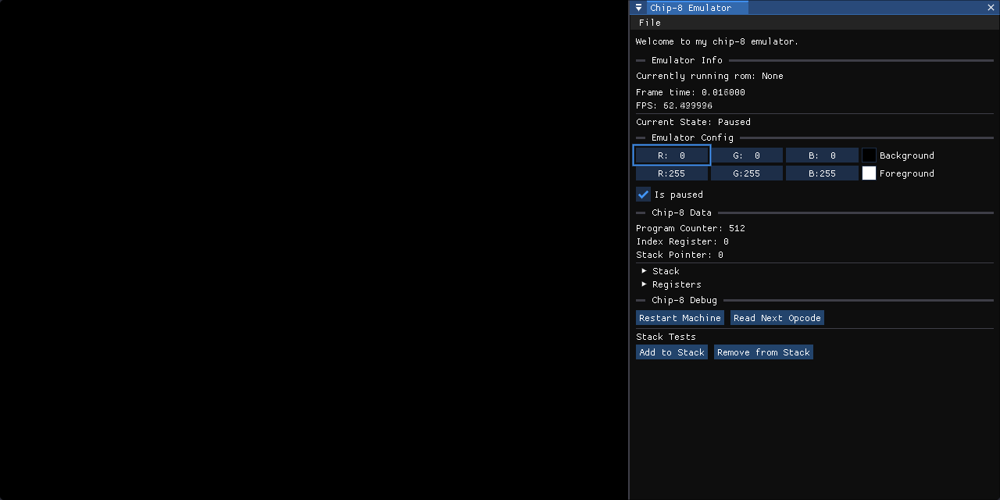

# Chip-8 Interpreter
Interpreter of the chip 8 language done in cpp.

# Special Thanks
[ImGui](https://github.com/ocornut/imgui) - For the GUI of the application

[Native File Dialog Extended](https://github.com/btzy/nativefiledialog-extended) - For the file dialog library when opening ch8 files